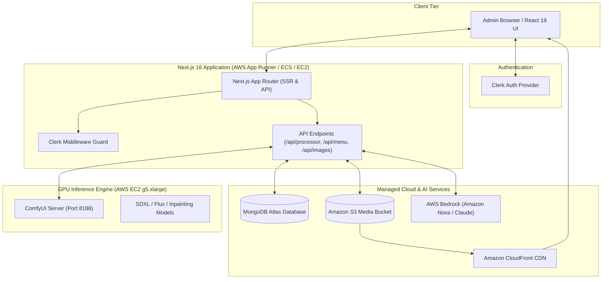

# 📸 FoodSnap AI Admin Studio

> Next-generation AI-powered food photography studio, catalog management, and composition pipeline for restaurants and food delivery platforms.

---

## 📑 Table of Contents

- [Overview](#-overview)
- [System Architecture](#-system-architecture)
- [Key Features](#-key-features)
- [Tech Stack](#-tech-stack)
- [Getting Started (Local Development)](#-getting-started-local-development)
  - [Prerequisites](#prerequisites)
  - [Installation & Environment Setup](#installation--environment-setup)
  - [Running Locally](#running-locally)
- [Recommended AWS Deployment Strategies](#-recommended-aws-deployment-strategies)
  - [1. Full Production Architecture Overview](#1-full-production-architecture-overview)
  - [2. Next.js Web App Deployment (App Runner / ECS Fargate)](#2-nextjs-web-app-deployment-app-runner--ecs-fargate-recommended)
  - [3. ComfyUI GPU Worker Deployment (AWS EC2 GPU Instance)](#3-comfyui-gpu-worker-deployment-aws-ec2-g5--g4dn)
  - [4. Storage & AI Configuration (S3, Bedrock, IAM)](#4-storage--ai-configuration-s3-bedrock-iam)
- [Docker & Containerization](#-docker--containerization)
- [CI/CD with GitHub Actions](#-cicd-with-github-actions)
- [Project Structure](#-project-structure)
- [Available Scripts](#-available-scripts)
- [Troubleshooting & FAQs](#-troubleshooting--faqs)

---

## 🌟 Overview

**FoodSnap Admin Studio** is a full-stack web platform built for high-throughput food catalog generation and image post-processing. It integrates generative diffusion pipelines (**ComfyUI**), multimodal foundation models (**AWS Bedrock / Amazon Nova Lite**), cloud storage (**AWS S3**), document databases (**MongoDB**), and user authentication (**Clerk**).

---

## 🏗 System Architecture



---

## ✨ Key Features

- **🎨 Drag-and-Drop Image Composition Studio**: Dynamic canvas with layer management, auto-cutout positioning, and background blending via `@dnd-kit` and Framer Motion.
- **🧠 Multimodal AI Analysis**: Automatic food item recognition, description generation, and styling prompt engineering using **AWS Bedrock** (`amazon.nova-lite-v1:0` / Claude).
- **⚡ Generative Diffusion Pipelines**: Direct websocket and REST communication with **ComfyUI** for automated background generation, upscaling, and relighting.
- **📦 Restaurant Menu Importer**: Instant catalog and menu scraping ingestion for platform partners (Zomato / Swiggy).
- **☁️ S3 Asset Vault & CDN Pipeline**: High-performance multi-file uploads with image proxying and cached CDN delivery.
- **🔒 Secure Authentication & Role Controls**: Route-level protection powered by **Clerk Middleware**.

---

## 🛠 Tech Stack

| Layer | Technology |
| :--- | :--- |
| **Framework** | [Next.js 16 (App Router)](https://nextjs.org/) |
| **UI Library & React** | [React 19](https://react.dev/), [Tailwind CSS v4](https://tailwindcss.com/), [Radix UI](https://www.radix-ui.com/), [Lucide Icons](https://lucide.dev/) |
| **State & Data Fetching** | [Redux Toolkit](https://redux-toolkit.js.org/), [TanStack React Query v5](https://tanstack.com/query) |
| **Canvas & Interactivity** | [`@dnd-kit`](https://dndkit.com/), [Framer Motion](https://www.framer.com/motion/) |
| **Authentication** | [Clerk](https://clerk.com/) |
| **Database** | [MongoDB](https://www.mongodb.com/) with [Mongoose 8](https://mongoosejs.com/) |
| **Cloud Services** | [Amazon S3](https://aws.amazon.com/s3/), [AWS Bedrock](https://aws.amazon.com/bedrock/), [CloudFront](https://aws.amazon.com/cloudfront/) |
| **AI Inference** | [ComfyUI](https://github.com/comfyanonymous/ComfyUI) (PyTorch / CUDA / MPS) |

---

## 🚀 Getting Started (Local Development)

### Prerequisites

- **Node.js**: `v20.x` or `v22.x` (LTS recommended)
- **Python**: `3.10` or `3.11` (for ComfyUI)
- **MongoDB**: Local MongoDB instance or free [MongoDB Atlas cluster](https://www.mongodb.com/atlas)
- **AWS Account**: S3 bucket and AWS Bedrock model access
- **Clerk Account**: Free development application at [clerk.com](https://clerk.com)

### Installation & Environment Setup

1. **Clone the repository**:
   ```bash
   git clone <repo-url>
   cd admin_foodsnap
   ```

2. **Install Node dependencies**:
   ```bash
   npm install
   ```

3. **Configure Environment Variables**:
   Copy the `.env.example` to `.env` and fill in your credentials:
   ```bash
   cp .env.example .env
   ```

   | Variable | Description |
   | :--- | :--- |
   | `MONGODB_URI` | MongoDB connection string (Atlas or local) |
   | `AWS_REGION` | AWS region for S3 bucket (e.g. `ap-southeast-2` or `us-east-1`) |
   | `AWS_ACCESS_KEY_ID` | AWS IAM Access Key ID for S3 operations |
   | `AWS_SECRET_ACCESS_KEY` | AWS IAM Secret Access Key for S3 operations |
   | `AWS_S3_BUCKET` | Name of your target S3 bucket |
   | `AWS_BEDROCK_REGION` | AWS region where Bedrock models are activated (e.g. `us-east-1`) |
   | `AWS_BEDROCK_ACCESS_KEY_ID` | IAM Key for Bedrock (defaults to `AWS_ACCESS_KEY_ID` if omitted) |
   | `AWS_BEDROCK_SECRET_ACCESS_KEY` | IAM Secret for Bedrock |
   | `AWS_BEDROCK_MODEL` | Bedrock model ID (default: `amazon.nova-lite-v1:0`) |
   | `NEXT_PUBLIC_CLERK_PUBLISHABLE_KEY` | Clerk publishable key (`pk_...`) |
   | `CLERK_SECRET_KEY` | Clerk backend secret key (`sk_...`) |

### Running Locally

You have multiple options depending on what you are working on:

#### Option 1: Full Studio Launcher (ComfyUI + Next.js concurrently)
Starts ComfyUI in the background, waits for health check, builds/starts Next.js, and auto-opens your browser:
```bash
npm run app
```

#### Option 2: Next.js Frontend Only (Dev Mode)
```bash
npm run dev
```
> *Runs Next.js with optimized memory bounds (`--max-old-space-size=1024`) on [http://localhost:3000](http://localhost:3000).*

#### Option 3: ComfyUI Backend Only
```bash
npm run comfy
```

---

## ☁️ Recommended AWS Deployment Strategies

Because FoodSnap Studio comprises a **Next.js Web Application** (CPU/memory-bound) and a **ComfyUI Generative Pipeline** (GPU-bound), the recommended production deployment separates these into decoupled tiers.

```
                    ┌───────────────────────────────┐
                    │       Amazon Route 53         │
                    └──────────────┬────────────────┘
                                   │
                    ┌──────────────▼────────────────┐
                    │      Amazon CloudFront        │
                    │   (Global Caching & SSL)      │
                    └───────┬──────────────┬────────┘
                            │              │
        Static / S3 Assets  │              │ Web App Requests
                            │              │
             ┌──────────────▼────┐    ┌────▼────────────────────────┐
             │   Amazon S3       │    │  AWS App Runner / ECS       │
             │   (Image Bucket)  │    │  (Next.js 16 Web App)       │
             └───────────────────┘    └──────────────┬──────────────┘
                                                     │
                             ┌───────────────────────┴───────────────────────┐
                             │                                               │
               ┌─────────────▼───────────────┐               ┌───────────────▼───────────────┐
               │    AWS Bedrock Service      │               │   AWS EC2 GPU (g5.xlarge)     │
               │ (Amazon Nova Lite / Claude) │               │   (ComfyUI Diffusion Engine)  │
               └─────────────────────────────┘               └───────────────────────────────┘
```

---

### 1. Next.js Web App Deployment (App Runner / ECS Fargate - Recommended)

**AWS App Runner** is the most cost-effective and low-maintenance option for running containerized Next.js apps with automatic SSL, auto-scaling, and health checks.

#### Step A: Multi-Stage Production `Dockerfile`
Create a `Dockerfile` in the project root:

```dockerfile
# 1. Base image
FROM node:20-alpine AS base
WORKDIR /app
RUN apk add --no-cache libc6-compat

# 2. Dependencies
FROM base AS deps
COPY package.json package-lock.json ./
RUN npm ci

# 3. Build stage
FROM base AS builder
COPY --from=deps /app/node_modules ./node_modules
COPY . .
ENV NEXT_TELEMETRY_DISABLED=1
ENV NODE_ENV=production
RUN npm run build

# 4. Production Runner
FROM base AS runner
ENV NODE_ENV=production
ENV PORT=3000
ENV HOSTNAME="0.0.0.0"

RUN addgroup --system --gid 1001 nodejs && \
    adduser --system --uid 1001 nextjs

COPY --from=builder /app/public ./public
COPY --from=builder --chown=nextjs:nodejs /app/.next/standalone ./
COPY --from=builder --chown=nextjs:nodejs /app/.next/static ./.next/static

USER nextjs
EXPOSE 3000

CMD ["node", "server.js"]
```

> **Note**: To enable standalone output in `next.config.mjs`, ensure `output: "standalone"` is configured.

#### Step B: Build and Push to Amazon ECR
```bash
# Authenticate Docker to AWS ECR
aws ecr get-login-password --region <region> | docker login --username AWS --password-stdin <aws_account_id>.dkr.ecr.<region>.amazonaws.com

# Build image
docker build -t foodsnap-admin .

# Tag & Push
docker tag foodsnap-admin:latest <aws_account_id>.dkr.ecr.<region>.amazonaws.com/foodsnap-admin:latest
docker push <aws_account_id>.dkr.ecr.<region>.amazonaws.com/foodsnap-admin:latest
```

#### Step C: Create AWS App Runner Service
1. In the **AWS Management Console**, navigate to **App Runner** → **Create Service**.
2. Select **Container Registry** → **Amazon ECR**.
3. Choose the image `<aws_account_id>.dkr.ecr.<region>.amazonaws.com/foodsnap-admin:latest`.
4. Configure compute: **1 vCPU, 2 GB RAM** (scale up based on traffic).
5. Add your `.env` configuration in **Environment Variables**.
6. Set port to `3000`. Click **Create & Deploy**.

---

### 2. ComfyUI GPU Worker Deployment (AWS EC2 g5 / g4dn)

For running generative image generation workflows, deploy ComfyUI to a dedicated GPU instance.

#### Recommended Instance Types
- **`g5.xlarge`** (Recommended): NVIDIA A10G (24 GB VRAM), 4 vCPUs, 16 GB RAM.
- **`g4dn.xlarge`** (Budget): NVIDIA T4 (16 GB VRAM), 4 vCPUs, 16 GB RAM.

#### Setup Instructions on Ubuntu Deep Learning AMI

1. **Launch an EC2 Instance** with the **Deep Learning OSS Nvidia Driver AMI GPU (Ubuntu 22.04)**.
2. **Attach an Amazon EBS volume (gp3)** with at least **100 GB** for model weights (Checkpoints, LoRAs, VAEs).
3. **SSH into the instance** and clone ComfyUI:
   ```bash
   ssh -i your-key.pem ubuntu@<ec2-public-ip>

   # Setup Python virtualenv
   sudo apt-get update && sudo apt-get install -y python3-venv git
   git clone https://github.com/comfyanonymous/ComfyUI.git
   cd ComfyUI
   python3 -m venv venv
   source venv/bin/activate
   pip install --upgrade pip
   pip install torch torchvision torchaudio --extra-index-url https://download.pytorch.org/whl/cu121
   pip install -r requirements.txt
   ```

4. **Create a Systemd Service** (`/etc/systemd/system/comfyui.service`):
   ```ini
   [Unit]
   Description=ComfyUI AI Inference Server
   After=network.target

   [Service]
   Type=simple
   User=ubuntu
   WorkingDirectory=/home/ubuntu/ComfyUI
   ExecStart=/home/ubuntu/ComfyUI/venv/bin/python main.py --listen 0.0.0.0 --port 8188 --enable-cors-header
   Restart=always
   RestartSec=5

   [Install]
   WantedBy=multi-user.target
   ```

5. **Start and enable ComfyUI**:
   ```bash
   sudo systemctl daemon-reload
   sudo systemctl enable comfyui
   sudo systemctl start comfyui
   ```

6. **Networking & Security**:
   - Place the EC2 instance in a **Private Subnet** of your VPC.
   - Allow inbound traffic on port `8188` **only** from the Security Group of the Next.js App Runner / ECS instance.

---

### 3. Storage & AI Configuration (S3, Bedrock, IAM)

#### S3 Bucket CORS Configuration
Configure your Amazon S3 bucket to allow direct image previews and uploads from your admin domain:

```json
[
  {
    "AllowedHeaders": ["*"],
    "AllowedMethods": ["GET", "PUT", "POST", "HEAD"],
    "AllowedOrigins": [
      "https://your-production-domain.com",
      "http://localhost:3000"
    ],
    "ExposeHeaders": ["ETag"]
  }
]
```

#### Minimal IAM Policy for Next.js App
Attach this IAM policy to your App Runner / ECS Instance Role:

```json
{
  "Version": "2012-10-17",
  "Statement": [
    {
      "Sid": "S3MediaAccess",
      "Effect": "Allow",
      "Action": [
        "s3:PutObject",
        "s3:GetObject",
        "s3:DeleteObject",
        "s3:ListBucket"
      ],
      "Resource": [
        "arn:aws:s3:::foodsnap-studio",
        "arn:aws:s3:::foodsnap-studio/*"
      ]
    },
    {
      "Sid": "BedrockInvokeAccess",
      "Effect": "Allow",
      "Action": [
        "bedrock:InvokeModel",
        "bedrock:InvokeModelWithResponseStream"
      ],
      "Resource": [
        "arn:aws:bedrock:*::foundation-model/*"
      ]
    }
  ]
}
```

#### AWS Bedrock Model Access
1. Navigate to the **AWS Bedrock Console** in `us-east-1` (or your preferred Bedrock region).
2. Go to **Model access** in the sidebar.
3. Request access for:
   - **Amazon: Nova Lite / Nova Pro** (`amazon.nova-lite-v1:0`)
   - **Anthropic: Claude 3.5 Sonnet / Haiku** (optional fallback)

---

## 🚢 CI/CD with GitHub Actions

Here is a ready-to-use GitHub Actions workflow (`.github/workflows/deploy.yml`) to automatically build and deploy the Next.js app to AWS:

```yaml
name: Deploy Next.js to AWS ECR & App Runner

on:
  push:
    branches: [ "main" ]

jobs:
  deploy:
    runs-on: ubuntu-latest
    steps:
      - name: Checkout Code
        uses: actions/checkout@v4

      - name: Configure AWS Credentials
        uses: aws-actions/configure-aws-credentials@v4
        with:
          aws-access-key-id: ${{ secrets.AWS_ACCESS_KEY_ID }}
          aws-secret-access-key: ${{ secrets.AWS_SECRET_ACCESS_KEY }}
          aws-region: ap-southeast-2

      - name: Log in to Amazon ECR
        id: login-ecr
        uses: aws-actions/amazon-ecr-login@v2

      - name: Build, Tag, and Push Docker Image
        env:
          ECR_REGISTRY: ${{ steps.login-ecr.outputs.registry }}
          ECR_REPOSITORY: foodsnap-admin
          IMAGE_TAG: ${{ github.sha }}
        run: |
          docker build -t $ECR_REGISTRY/$ECR_REPOSITORY:$IMAGE_TAG .
          docker tag $ECR_REGISTRY/$ECR_REPOSITORY:$IMAGE_TAG $ECR_REGISTRY/$ECR_REPOSITORY:latest
          docker push $ECR_REGISTRY/$ECR_REPOSITORY:latest
```

---

## 📁 Project Structure

```text
admin_foodsnap/
├── public/                 # Static assets and icons
├── scripts/
│   ├── extra_model_paths.yaml # ComfyUI model directories
│   ├── start-all.sh        # One-command full-stack launcher
│   └── start-comfy.sh      # Standalone ComfyUI runner
├── src/
│   ├── app/
│   │   ├── (auth)/         # Clerk Auth pages (sign-in, sign-up)
│   │   ├── (root)/         # Main authenticated dashboard & studio
│   │   │   ├── images/     # Image asset gallery & management
│   │   │   ├── processor/  # AI Image Composition & Generation Canvas
│   │   │   └── products/   # Catalog & product management
│   │   ├── api/            # Serverless API routes (S3, Bedrock, Menu)
│   │   │   ├── backgrounds/
│   │   │   ├── comfyui/
│   │   │   ├── dashboard/
│   │   │   ├── images/
│   │   │   ├── menu/       # Zomato / Swiggy menu parsers
│   │   │   └── processor/
│   │   ├── globals.css     # Tailwind CSS styles & design tokens
│   │   └── layout.js       # Root Layout & Theme/Query Providers
│   ├── components/         # Reusable UI & Feature components
│   ├── hooks/              # Custom React hooks
│   ├── lib/                # AWS SDK clients (S3, Bedrock) & DB connectors
│   ├── models/             # Mongoose schemas (Product, Image, Background)
│   ├── providers/          # Redux, React Query, Theme Providers
│   ├── services/           # Data & API abstraction services
│   └── middleware.js       # Clerk Route Guard & Public URL Matcher
├── .env.example            # Environment variables template
├── components.json         # UI component config
├── next.config.mjs         # Next.js build configuration
└── package.json            # Project dependencies & scripts
```

---

## 📜 Available Scripts

| Script | Command | Purpose |
| :--- | :--- | :--- |
| `npm run app` | `bash scripts/start-all.sh` | Launches ComfyUI + Next.js concurrently in production mode |
| `npm run dev` | `NODE_OPTIONS='--max-old-space-size=1024' next dev` | Runs Next.js development server with bounded RAM |
| `npm run build` | `next build` | Compiles optimized Next.js production build |
| `npm run start` | `next start` | Runs Next.js standalone production server |
| `npm run comfy` | `bash scripts/start-comfy.sh` | Starts ComfyUI server on port `8188` |
| `npm run lint` | `eslint` | Lints project source code for syntax and best practices |

---

## ❓ Troubleshooting & FAQs

### 1. ComfyUI connection refused on `127.0.0.1:8188`
- Ensure ComfyUI is running via `npm run comfy` or systemd service.
- Verify `--listen 127.0.0.1` (or `0.0.0.0`) and `--enable-cors-header` are passed.
- Check that port `8188` is open in the security group if hosting ComfyUI remotely.

### 2. Node.js heap out-of-memory errors during build
- Set `NODE_OPTIONS="--max-old-space-size=4096"` in CI/CD build environments to prevent compilation memory spikes.

### 3. S3 403 Forbidden on upload
- Verify that your IAM credentials have `s3:PutObject` permission on `arn:aws:s3:::<your-bucket>/*`.
- Ensure the bucket name and AWS region in `.env` match your S3 bucket configuration.

---

## 📄 License

This project is proprietary and confidential. All rights reserved.
